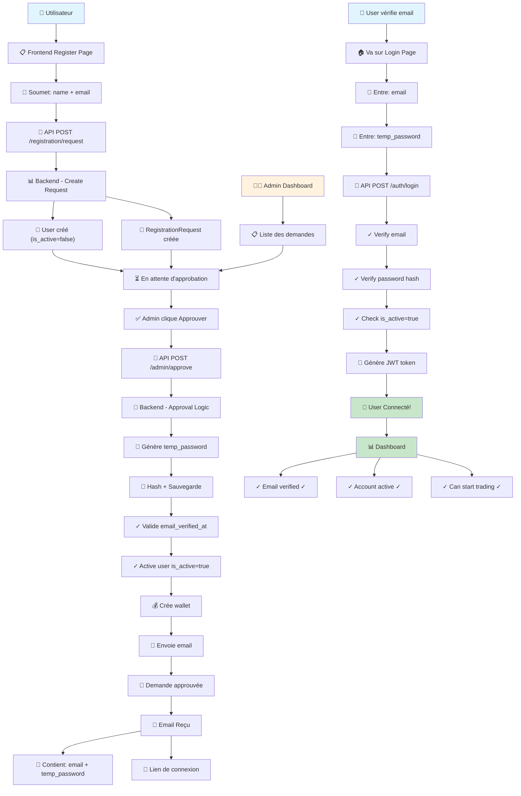
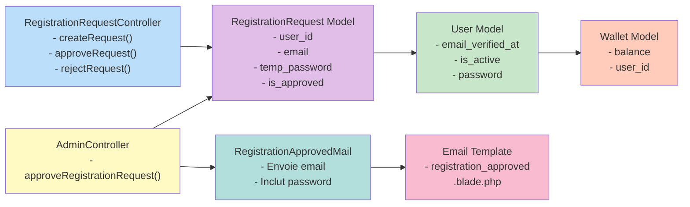
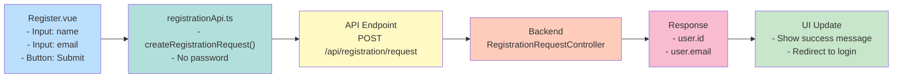
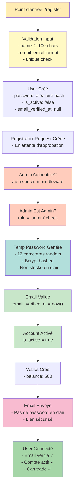
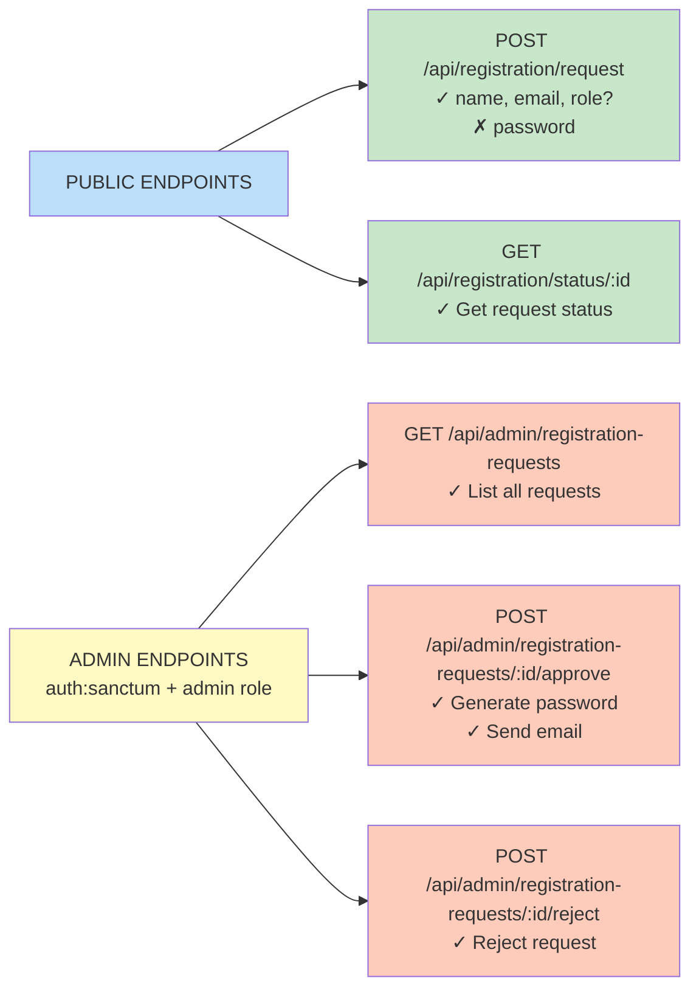
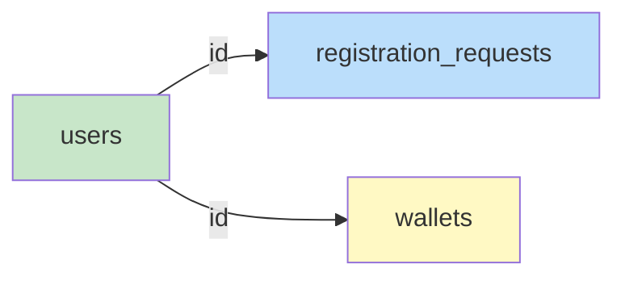
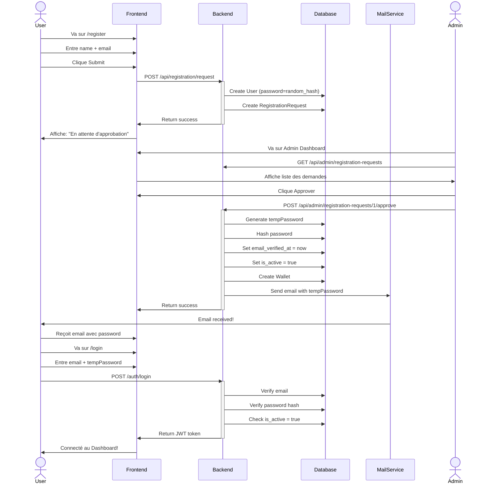
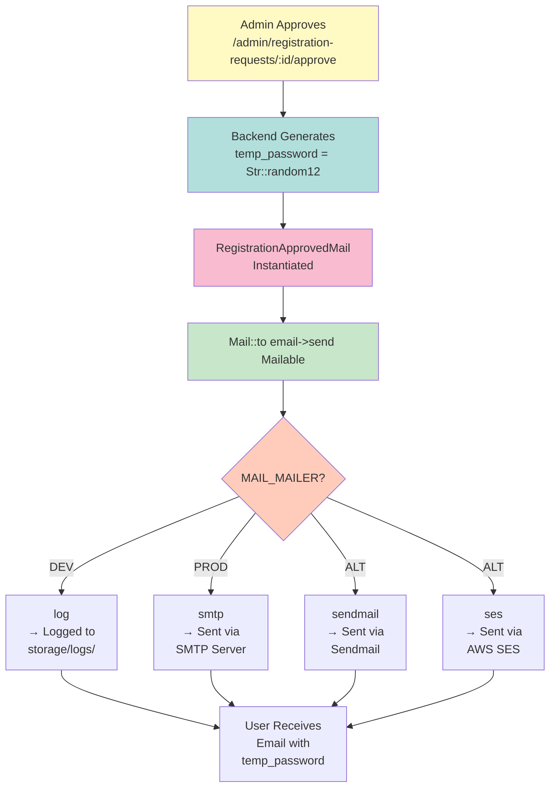

# Architecture et Flux du Système d'Authentification par Email

## Diagramme du Flux Complet



## Diagramme de la Structure Backend



## Diagramme de la Structure Frontend



## Diagramme de Sécurité



## Diagramme API Endpoints



## Diagramme Database Schema



### users table
- id
- name
- email (unique)
- password (hashed)
- email_verified_at ← **AUTO SET AT APPROVAL**
- is_active ← **SET TO TRUE AT APPROVAL**
- role (client/admin)
- created_at, updated_at

### registration_requests table
- id
- user_id (FK)
- email
- role
- **temp_password** ← **NEW FIELD**
- is_approved
- is_rejected
- rejection_reason
- created_at, updated_at

### wallets table
- id
- user_id (FK)
- balance
- public_address
- private_address
- created_at updated_at

---

## Flux de Données - Request Complete



---

## Configuration Files Diagram

```
backend/
├── .env
│   ├── APP_URL=http://localhost:8000
│   └── FRONTEND_URL=http://localhost:5173
│
├── .env.example
│   ├── APP_URL=...
│   └── FRONTEND_URL=...
│
├── config/
│   ├── app.php
│   │   └── 'frontend_url' => env('FRONTEND_URL')
│   │
│   └── mail.php
│       └── MAIL_MAILER (log/smtp/sendmail...)
│
├── app/
│   ├── Http/Controllers/
│   │   ├── RegistrationRequestController.php
│   │   └── AdminController.php
│   │
│   ├── Mail/
│   │   └── RegistrationApprovedMail.php
│   │
│   └── Models/
│       └── RegistrationRequest.php
│
├── resources/views/
│   └── emails/
│       └── registration_approved.blade.php
│
└── database/migrations/
    ├── 2025_12_02_000001_create_registration_requests_table.php
    └── 2025_12_02_000002_add_temp_password_*.php

frontend/
├── src/
│   ├── services/
│   │   └── registrationApi.ts
│   │
│   └── views/
│       └── Register.vue
```

---

## Email Flow Diagram



---

*Créé le: 2025-04-15*  
*Version: 1.0*  
*Status: Production Ready ✅*
